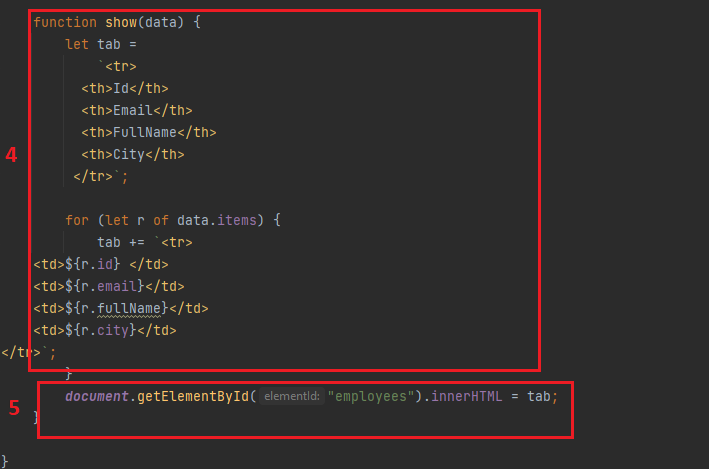
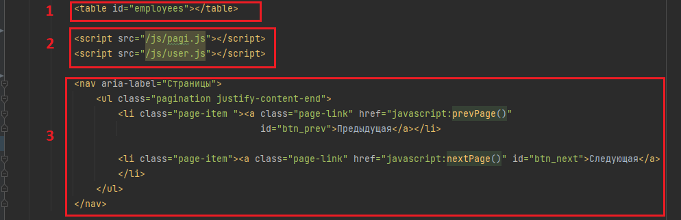

#Документация по использованию Пагинации на фронте.

##Работа функций (файл user.js)

1. Получение токена из cookie.
2. Обращение к необходимой нам api (в нашем случае - получение всех юзеров отсортированных по дате регистрации)
3. Определение асинхронной функции с передачей в нее api- мы сохраняем ответ полученный из нашего запроса и передаем в Заголовок наш токен. Далее сохраняем наш ответ.
4. Парсим в таблицу куда будем передавать необходимые нам items 
5. Указываем как будем обращаться к нашей таблице в файле Html

##Работа с Html.
1. Вызов нашей таблицы в Html
2. Импорт наших файлов js в Html
3. Отрисовка кнопок "Предыдущей" и "Следующей"

